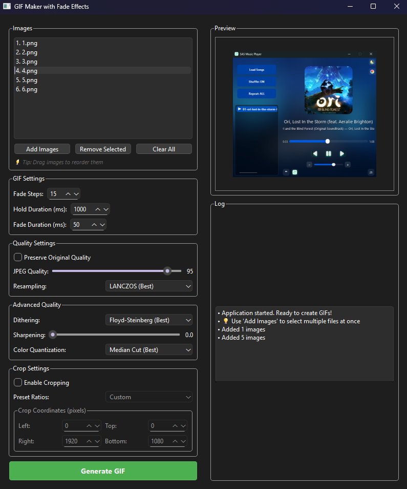

# GIF Maker with Fade Effects

A professional PyQt6-based desktop application that creates smooth, high-quality animated GIFs with customizable fade transitions between images. Perfect for creating cinematic slideshows, image sequences, and artistic animations.

## 🎬 Screenshots

App Interface

## ✨ Features

### Core Functionality
- **Smooth Fade Transitions**: Create beautiful fade effects between images
- **Drag & Drop Interface**: Easily reorder images by dragging them in the list
- **Real-time Preview**: See selected images instantly in the preview panel
- **Multi-threading**: Non-blocking GIF generation with progress tracking
- **Batch Processing**: Add multiple images at once

### Advanced Quality Controls
- **Preserve Original Quality**: Maintain source image dimensions and quality
- **Custom Quality Settings**: Adjustable JPEG quality (50-100%)
- **Resampling Methods**: Choose from LANCZOS, BICUBIC, BILINEAR, or NEAREST
- **Advanced Dithering**: Floyd-Steinberg, Ordered, or None
- **Image Sharpening**: Adjustable unsharp mask filter (0-2.0 strength)
- **Color Quantization**: Median Cut, Maximum Coverage, or Fast Octree

### Cropping & Aspect Ratios
- **Smart Cropping**: Custom crop areas with pixel-perfect control
- **Preset Ratios**: 16:9, 4:3, 1:1, 9:16, 21:9 aspect ratios
- **Manual Coordinates**: Fine-tune crop boundaries

### Timing Controls
- **Fade Steps**: 5-50 transition frames for smoothness control
- **Hold Duration**: 100-5000ms per image display time
- **Fade Duration**: 10-500ms transition speed

## 🔧 Requirements

- **Python 3.7+**
- **PyQt6** - Modern GUI framework
- **Pillow (PIL)** - Image processing library

## 📦 Installation

1. **Clone the repository:**

2. **Install dependencies:**

3. **Run the application:**

## 🚀 Quick Start

1. **Launch** the application
2. **Add Images**: Click "Add Images" to select multiple image files
3. **Reorder** (optional): Drag images in the list to change sequence
4. **Adjust Settings**: Configure fade steps, timing, and quality options
5. **Preview**: Select images to see them in the preview panel
6. **Generate**: Click "Generate GIF" and choose output location

## 📖 Detailed Usage

### Adding Images
- Use **"Add Images"** button to select multiple files at once
- Supported formats: PNG, JPG, JPEG, BMP, GIF, TIFF
- **Drag and drop** images in the list to reorder them
- Use **"Remove Selected"** or **"Clear All"** to manage your list

### Quality Settings
- **Preserve Original Quality**: Keeps source dimensions (larger file size)
- **JPEG Quality**: 95 recommended for best results, lower for smaller files
- **Resampling**: LANCZOS provides best quality for resizing

### Advanced Options
- **Dithering**: Floyd-Steinberg gives smoothest color gradients
- **Sharpening**: Add 0.5-1.0 strength for crisper images
- **Color Quantization**: Median Cut provides best color accuracy

### Cropping
1. Enable **"Enable Cropping"** checkbox
2. Choose from **preset ratios** or set custom coordinates
3. Coordinates are in pixels: Left, Top, Right, Bottom

## 🛠️ Technical Details

### Architecture
- **Modular Design**: Separate classes for UI, processing, and threading
- **Multi-threading**: Prevents UI freezing during processing
- **Memory Efficient**: Optimized image handling for large batches
- **Error Handling**: Comprehensive error reporting and logging

### Performance Features
- **Multi-stage Resizing**: Better quality when downscaling significantly
- **Color Space Preservation**: Maintains ICC profiles when available
- **Adaptive Quantization**: Per-frame palette optimization for quality mode
- **Progress Tracking**: Real-time processing updates

### File Output
- **Standard GIF Format**: Compatible with all platforms and browsers
- **Optimized Compression**: Automatic optimization for smaller files
- **Loop Control**: Infinite loop animations
- **Frame Disposal**: Proper frame cleanup for smooth playback

## 🎯 Use Cases

- **Photography**: Create slideshow animations from photo collections
- **Art & Design**: Showcase artwork with smooth transitions
- **Marketing**: Product demonstration animations
- **Social Media**: Eye-catching animated content
- **Presentations**: Dynamic visual transitions

## 🤝 Contributing

Contributions are welcome! Please feel free to submit a Pull Request. For major changes, please open an issue first to discuss what you would like to change.

### Development Setup
1. Fork the repository
2. Create a feature branch (`git checkout -b feature/amazing-feature`)
3. Commit your changes (`git commit -m 'Add amazing feature'`)
4. Push to the branch (`git push origin feature/amazing-feature`)
5. Open a Pull Request

## 📝 License

This project is licensed under the MIT License - see the [LICENSE](LICENSE) file for details.

## 🙏 Acknowledgments

- Built with [PyQt6](https://www.riverbankcomputing.com/software/pyqt/) for the GUI framework
- Image processing powered by [Pillow](https://pillow.readthedocs.io/)
- Inspired by the need for high-quality GIF creation tools

## 📞 Support

If you encounter any issues or have questions:
- Open an issue on GitHub
- Check the application's built-in log panel for error details
- Ensure all dependencies are properly installed

---

**Made with ❤️ for the creative community**
